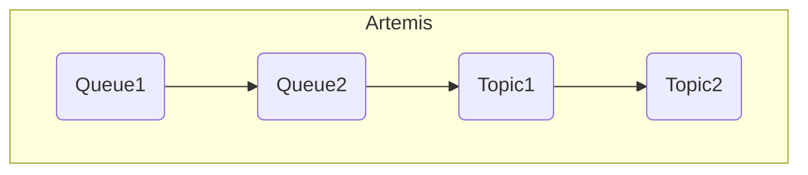

# Artemis Testing

[](https://github.com/interlok-testing/testing_artemis/blob/develop/LICENSE)
[](https://github.com/interlok-testing/testing_artemis/actions/workflows/gradle-build.yml)

Project tests interlok-artemis features

## What it does

This project contains a single instance of Interlok that launches an Apache Artemis broker upon start-up.  Once started a single polling trigger will produce a message every 10 seconds and send to a queue on the artemis broker.  
A second workflow will consume the message and move to a second queue using a JMS 2.0 asynchronous producer.
A third workflow will again consume the message and send to a topic, where a final workflow is subscribed to that topic.



 
## Getting started

* `./gradlew clean build`
* `(cd ./build/distribution && java -jar lib/interlok-boot.jar)`

### The logging

Once started you will see the embedded Artemis broker starting up;

```
[c.a.m.a.ArtemisServerComponent.run()] Creating minimal Artemis broker
```
